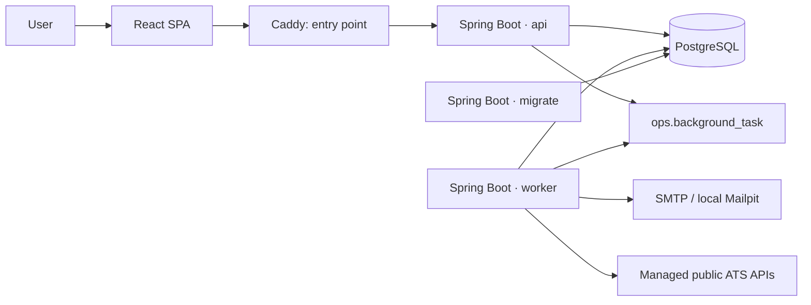
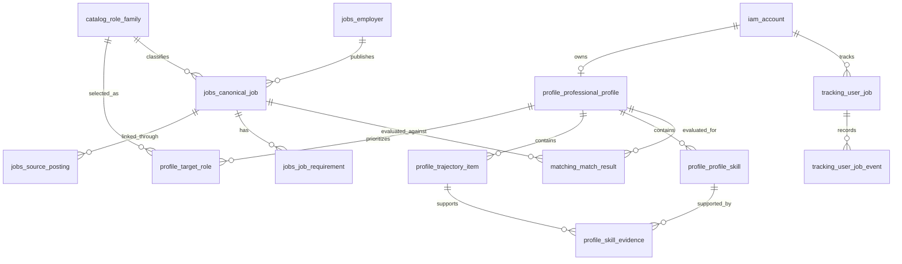

# JobMatch

JobMatch turns a professional profile into explainable recommendations for technology jobs. It centralizes public job boards configured by the platform, normalizes roles and skills, calculates deterministic compatibility, and preserves the history of every application.

It is designed for candidates who want to understand why a job fits —or what they still need to document— and for engineers who need a traceable, reproducible, deployable application that does not rely on AI to produce its score.

## 1. What the project solves

- Manual profile with target roles, preferences, career history, education, certifications, languages, and skills backed by evidence.
- Active-job exploration, full job details, saved searches, and filters for date, work arrangement, employment type, salary, and roles.
- **For you** recommendations derived exclusively from the profile, exposing score, components, matches, gaps, and considerations.
- Job tracking as saved, discarded, applied, interview, offer, accepted, rejected, or withdrawn, with an auditable history.
- Background ingestion from platform-managed public job boards; users do not submit ATS URLs or query external providers directly.

Automatic CV import is outside the current scope; profiles are maintained manually.

## 2. Stack

| Area | Implemented technologies |
| --- | --- |
| Backend | Java 21, Spring Boot 3.5.7, Spring Web, Validation, Security, JDBC, Session JDBC, Mail, Actuator |
| Data | PostgreSQL 17, Flyway, `JdbcClient` |
| Observability | Micrometer/Prometheus registry, liveness/readiness, `X-Trace-Id` |
| Frontend | React 19.1, TypeScript 5.8.3, Vite 6.4.3, Vitest 3.2.7 |
| Infrastructure | Docker Compose, Caddy 2.10, Nginx 1.27 |
| Testing | JUnit 5, Spring Security Test, Testcontainers PostgreSQL, ArchUnit, Vitest, k6 |
| Automation | GitHub Actions, Maven 3.9.11, Node 22 |

The project does not use JPA/Hibernate, JWT, Swagger/OpenAPI, or an external message broker.

## 3. Architecture

The backend is a **modular monolith**. The same Spring Boot artifact runs with the `api` profile (HTTP), `worker` profile (background work), or `migrate` profile (Flyway, then exit). Each module separates domain, application ports, and JDBC/web/worker adapters; ArchUnit verifies their boundaries.



### Layers and flow

- `*/adapters/web`: HTTP controllers and account resolution from the session.
- `*/application`: validation, transactions, and ports such as `ProfileRepository`, `MatchingRepository`, and `BackgroundTaskPort`.
- `Jdbc*Adapter`: PostgreSQL SQL implementations; no ORM entities are exposed.
- `*/domain`: records, enums, and pure policies, including `DeduplicationPolicy` and `DeterministicScoringV1`.
- The worker claims leased tasks from PostgreSQL and executes email, synchronization, and recommendation handlers.

The main modules are `identity`, `profile`, `catalog`, `discovery`, `ingestion`, `matching`, `tracking`, and `operations`. REST errors are normalized as `ProblemDetail` with a code, invalid fields where applicable, a `traceId`, and a retry indicator.

## 4. Business rules

### Identity and profile

- Passwords must contain 12 to 128 characters. Registration does not disclose whether an email already exists; verification tokens last 24 hours and password-reset tokens last 30 minutes.
- Limits: 10 target roles, 50 excluded employers, 100 career-history items and skills, 30 education items, 50 certifications, and 20 languages.
- A target role must be active in the catalog. A skill is either catalog-backed **or** custom; custom skills do not participate in matching.
- Skill evidence must reference career history included in the same profile. Experience uses unique calendar months and weights formal employment and practical experience differently.
- `If-Match` prevents profile and saved-search writes over a stale version.

### Jobs, search, and ingestion

- Only active canonical jobs are displayed. Cursor search returns at most 25 results per page and accepts at most 10 roles per query.
- An account can save up to 20 searches.
- ATS boards are registered internally. Lever and Ashby synchronize only managed boards and accept Mexican locations only. Greenhouse has an adapter, but its boards require explicit enablement. Jooble and Adzuna remain simulated adapters in this repository.
- Scheduled queries run roughly every six hours with jitter. PostgreSQL records source quota, leases, consecutive failures, and circuit state.
- Deduplication checks exact identity, a deterministic key, and then similarity. It only auto-merges at 0.92 or above with title/employer minimums; ambiguous cases remain separate and are audited.

### Compatibility and tracking

- `score-5` sums six components: role/responsibilities (25), technologies (25), seniority/experience (20), projects (15), experience type (10), and preferences/freshness (5).
- Missing data produces neutral considerations. Mandatory gaps can cap the score at 64; a Junior profile against a higher-level job can be capped at 44 when required experience is not covered.
- Each evaluation stores requirement/evidence snapshots and profile, job, catalog, and algorithm versions; results can be reconstructed after the profile changes.
- Recommendations are generated for target roles: up to 2,000 candidates and 500 persisted results per profile version.
- Tracking starts at `SAVED`, `DISCARDED`, or `APPLIED`; transitions are validated, `Idempotency-Key` makes retries safe, and `If-Match` detects conflicts. A discarded job is no longer recommended until the decision is revoked.

## 5. Database design

PostgreSQL is divided into schemas, and every change goes through versioned Flyway migrations in `backend/src/main/resources/db/migration`.



| Schema | Responsibility |
| --- | --- |
| `iam` | Accounts, email tokens, attempts, and JDBC sessions. |
| `catalog` | Versions, role families, skills, and aliases. |
| `profile` | Profile, preferences, career history, education, languages, skills, evidence, and saved searches. |
| `jobs` | Employers, canonical jobs, locations, postings, requirements, and search documents. |
| `ingestion` | Connector configuration/execution, quotas, payloads, errors, and merge audits. |
| `matching` | Versioned facts, results, reasons, and recommendations. |
| `tracking` | Impressions, personal job state, and transition history. |
| `ops` | Background tasks, outbox, and idempotency. |

Public keys are UUIDs while tables retain numeric internal keys. Constraints include uniqueness per account/job, normalized external URL per source, one preferred posting per job, and one evaluation per version combination. The `cvimport` schema remains for Flyway compatibility but is not active in the product.

## 6. Security

- Spring Security uses opaque sessions backed by Spring Session JDBC; there is no JWT.
- The cookie is `HttpOnly` and `SameSite=Lax`; production uses `__Host-` plus `Secure`. It has a 30-minute idle timeout and a 12-hour absolute limit.
- Mutations require a session CSRF token in `X-CSRF-TOKEN`; the frontend obtains it from `GET /api/v1/auth/csrf`.
- Registration, verification, login, and password recovery are public. The rest of `/api/v1/**` requires authentication; CORS is disabled for the first-party SPA.
- Authentication failures are rate-limited by email and IP using hashes salted with `RATE_LIMIT_PEPPER`.
- Password changes and account deletion revoke sessions. Deletion removes associated personal data and anonymizes/marks the account.
- Caddy terminates TLS in production, exposes the application and health checks, and configures CSP, HSTS, `nosniff`, and a referrer policy. Metrics are not published through the proxy.

Flow: registration → verification email → login → session → CSRF → authenticated requests. When the session expires, the SPA clears CSRF state and returns to sign-in.

## 7. Testing

- JUnit covers identity, profile, search, deduplication, tracking, facts, and scoring.
- Testcontainers runs PostgreSQL-backed JDBC and migration integrations.
- ArchUnit validates layer/module dependencies.
- Vitest covers utilities and the SPA smoke test.
- E2E scripts cover identity, profile, search, ingestion, matching, tracking, proxy/security, and backup/restore.
- `tests/load/search.js` uses k6 against authenticated local search without invoking external connectors.

```bash
# Backend: unit, integration, and architecture tests
cd backend && mvn -B verify

# Frontend
cd frontend && npm ci && npm test && npm run build

# Dockerized backend with Testcontainers
docker compose -f compose.yaml -f compose.test.yaml up --build --abort-on-container-exit --exit-code-from backend-tests
```

No coverage percentage is claimed because the repository does not generate a versioned coverage report.

## 8. Technical decisions

| Decision | Implementation and observable benefit |
| --- | --- |
| Modular monolith | One JAR for API, worker, and migrator; simple deployment and independent scaling without shared memory. |
| Ports + JDBC | Services depend on interfaces and `Jdbc*Adapter` classes contain SQL; boundaries stay explicit without an ORM. |
| Durable PostgreSQL queue | `ops.background_task` uses `FOR UPDATE SKIP LOCKED`, leases, and attempts; no separate broker is operated and worker restarts are tolerated. |
| Idempotency and concurrency | `Idempotency-Key` protects tracking and `If-Match` protects versioned resources; duplicates and silent overwrites are avoided. |
| Alias-based catalog | Spanish/English variants resolve to a stable family while seniority remains separate; this improves classification and filtering. |
| Deterministic matching | No network or AI dependency, with snapshots/versions; results are explainable, testable, and reproducible. |
| Conservative ingestion | Persisted quotas, circuit breaker, normalization, and deduplication; doubtful cases are not merged. |
| Immutable images | Release publishes backend/frontend with a SHA tag; EC2 pulls images and migrates before updating API/worker. |

Details: [`docs/adr`](docs/adr/README.md).

## 9. How to run

### Prerequisites

- Docker Engine with Docker Compose v2 for the complete environment.
- Java 21 and Maven for backend development outside Docker.
- Node 22 and npm for frontend development outside Docker.

### Local startup

```bash
git clone <REPOSITORY_URL>
cd JobMatch
cp .env.example .env
docker compose up --build
```

- Application: http://localhost:8090
- Local Mailpit: http://localhost:8025
- Readiness: http://localhost:8090/actuator/health/readiness

`migrate` applies Flyway and exits; `api` and `worker` share the backend against PostgreSQL. Mailpit is for development only.

### Environment variables

`.env.example` contains development values. Before using a shared environment, replace `POSTGRES_*`, `TOKEN_SECRET`, `RATE_LIMIT_PEPPER`, `APP_HOST`, `HTTP_PORT`, `HTTPS_PORT`, `SMTP_*`, `SESSION_COOKIE_*`, and `PUBLIC_BASE_URL`. Never publish secrets. For production, start with `deploy/production.env.example` outside the repository, for example at `/srv/jobmatch/.env`.

### Development without Docker

The database and migrations must exist before starting API/worker processes.

```bash
cd backend
mvn spring-boot:run -Dspring-boot.run.profiles=migrate
mvn spring-boot:run -Dspring-boot.run.profiles=api

# In another terminal
cd backend && mvn spring-boot:run -Dspring-boot.run.profiles=worker

cd frontend && npm ci && npm run dev
```

### Production on EC2

The repository includes `compose.prod.yaml`, production Caddy config, preflight checks, backup/restore scripts, and CI/release workflows. Configure DNS for `APP_HOST`, open ports 80/443 only, create `/srv/jobmatch/.env` from the template, then run:

```bash
cd /srv/jobmatch
sh scripts/preflight-production.sh /srv/jobmatch/.env
docker compose --env-file .env -f compose.yaml -f compose.prod.yaml up -d
```

CI runs on pull requests and changes to `main`/`master`. The manual release publishes Docker images and can deploy them through SSH. See [`docs/phase-8.md`](docs/phase-8.md) for rollback, limits, metrics, k6, and backups.

## API documentation

There is no Swagger/OpenAPI in this repository. The REST API lives under `/api/v1`; phase-specific contracts are in [`docs`](docs).

| Area | Main endpoints |
| --- | --- |
| Identity | `/auth/csrf`, `/auth/register`, `/auth/login`, `/auth/logout`, verification, recovery, and `/me/account` |
| Profile/catalog | `/catalog/roles`, `/catalog/skills`, `/me/profile`, `/me/target-roles`, `/me/trajectory`, `/me/skills` |
| Jobs | `/jobs/search`, `/jobs/{id}`, `/me/saved-searches` |
| Compatibility | `/jobs/{jobId}/match`, `/matches/{resultId}`, `/me/recommendations` |
| Tracking | `/me/job-impressions`, `/me/job-activity`, `/me/jobs/{jobId}/tracking`, `/me/tracking` |
| Ingestion | `/job-refreshes` and `/job-refreshes/{id}` |

Authenticated mutations send CSRF; profile, saved-search, and tracking operations require concurrency headers where applicable.

## Repository map

```text
backend/       Spring Boot, modules, Flyway migrations, and Java tests
frontend/      React SPA, styles, and Vitest tests
deploy/        Caddy and the production template
docs/          ADRs and phase documentation
scripts/       E2E, preflight, fixtures, and backup/restore
tests/load/    Authenticated-search k6 test
```
